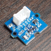

# MjGrove

## 概要

Wio LTE/Wio 3Gで利用できる、Groveライブラリです。  
Groveモジュールのクラスと、Grove対応ボードのクラスが用意されており、この2つのクラスを組み合わせるだけでGroveモジュールから値の取得、設定ができます。  

## 対応しているGrove対応ボードとGroveモジュール

### Grove対応ボード

|Product|Platform|Library|MjGrove|Note|
|:--|:--|:--|:--|:--|
|[Wio LTE JP Version](https://seeedjp.github.io/Wiki/Wio_LTE_for_Arduino/Home-ja.html)|Seeed STM32F4 Boards by Seeed Studio|Wio LTE Arduino Library by Seeed Studio|×|Seeed本社|
||Seeed STM32F4 Boards by Seeed Studio|Wio LTE for Arduino by Seeed K.K.|×|ディスコン|
||Seeed STM32F4 Board (JP mirror) by Seeed K.K.|Wio LTE for Arduino by Seeed K.K.|×|
||**SeeedJP STM32 Boards by Seeed K.K.**|**Wio LTE for Arduino by Seeed K.K.**|○|
|[Wio 3G SORACOM Edition](https://soracom.jp/products/module/wio_3g_soracom_edition/)|SeeedJP STM32F4 Boards by Seeed K.K.|Wio 3G for Arduino by Seeed K.K.|×|ディスコン|
||SeeedJP STM32F4 Boards by Seeed K.K.|Wio cell lib for Arduino by Seeed K.K.|×|
||**SeeedJP STM32 Boards by Seeed K.K.**|**Wio cell lib for Arduino by Seeed K.K.**|○|
|[Wio LTE M1/NB1(BG96)](https://soracom.jp/products/module/wio_lte_m1_nb1/)|SeeedJP STM32F4 Boards by Seeed K.K.|Wio cell lib for Arduino by Seeed K.K.|×|
||**SeeedJP STM32 Boards by Seeed K.K.**|**Wio cell lib for Arduino by Seeed K.K.**|○|

### Groveモジュール

|Pic|Class|SKU|Name|Note|
|:--|:--|:--|:--|:--|
||GroveGasO2|101020002|[Grove - Oxygen Sensor(ME2-O2-Ф20)](http://wiki.seeedstudio.com/Grove-Gas_Sensor-O2/)|作成中|
||GroveButton|101020003|[Grove - Button](http://wiki.seeedstudio.com/Grove-Button/)||
||GroveUltrasonicRanger|101020010|[Grove - Ultrasonic Ranger](http://wiki.seeedstudio.com/Grove-Ultrasonic_Ranger/)||
||GroveTempHumiDHT11|101020011|[Grove - Temperature & Humidity Sensor (DHT11)](http://wiki.seeedstudio.com/Grove-TemperatureAndHumidity_Sensor/)||
||GroveRotaryAngle|101020017|[Grove - Rotary Angle Sensor](http://wiki.seeedstudio.com/Grove-Rotary_Angle_Sensor/)||
||GroveDigitalLight|101020030|[Grove - Digital Light Sensor](http://wiki.seeedstudio.com/Grove-Digital_Light_Sensor/)||
||GroveTouch|101020037|[Grove - Touch Sensor](http://wiki.seeedstudio.com/Grove-Touch_Sensor/)||
||GroveMagneticSwitch|101020038|[Grove - Magnetic Switch](http://wiki.seeedstudio.com/Grove-Magnetic_Switch/)||
||GroveAccelerometer16G|101020054|[Grove - 3-Axis Digital Accelerometer(±16g)](http://wiki.seeedstudio.com/Grove-3-Axis_Digital_Accelerometer-16g/)||
||GroveEMGDetector|101020058|[Grove - EMG Detector](http://wiki.seeedstudio.com/Grove-EMG_Detector/)||
||~~GroveAirQuality~~|101020078|[Grove - Air quality sensor v1.3](http://wiki.seeedstudio.com/Grove-Air_Quality_Sensor_v1.3/)|必要電流が多すぎてWio LTE/3Gでは使えない|
||GroveMiniTrackBall|101020091|[Grove - Mini Track Ball](http://wiki.seeedstudio.com/Grove-Mini_Track_Ball/)|作成中|
||GroveTempHumiBaroBME280|101020193|[Grove - Temp&Humi&Barometer Sensor (BME280)](http://wiki.seeedstudio.com/Grove-Barometer_Sensor-BME280/)||
||GroveTempHumiSHT31|101020212|[Grove - Temperature&Humidity Sensor (SHT31)](http://wiki.seeedstudio.com/Grove-TempAndHumi_Sensor-SHT31/)||
||GroveSpeechRecognizer|101020232|[Grove - Speech Recognizer](http://wiki.seeedstudio.com/Grove-Speech_Recognizer/)||
||GroveI2CColorSensor2|101020341|[Grove - I2C Color Sensor V2](https://www.seeedstudio.com/Grove-I2C-Color-Sensor-V2-p-2890.html)|作成中|
||GroveTempOneWire|101990019|One Wire Temperature Sensor||
||GroveRelay|103020005|[Grove - Relay](http://wiki.seeedstudio.com/Grove-Relay/)||
||GroveLEDBar2|104020006|[Grove LED Bar v2.0](http://wiki.seeedstudio.com/Grove-LED_Bar/)||
||Grove4DigitDisplay|104030003|[Grove - 4-Digit Display](http://wiki.seeedstudio.com/Grove-4-Digit_Display/)||
||GroveOLEDDisplay096|104030008|[Grove - OLED Display 0.96"](http://wiki.seeedstudio.com/Grove-OLED_Display_0.96inch/)||
||GroveCircularLED|104030013|[Grove - Circular LED](http://wiki.seeedstudio.com/Grove-Circular_LED/)||
||GroveBuzzer|107020000|[Grove - Buzzer](http://wiki.seeedstudio.com/Grove-Buzzer/)||
||GroveHighTemp|111020002|[Grove - High Temperature Sensor](http://wiki.seeedstudio.com/Grove-High_Temperature_Sensor/)||
||GroveGPS|113020003|[Grove - GPS](http://wiki.seeedstudio.com/Grove-GPS/)||
||GroveTiltSwitch|101020025|[Grove - Tilt Switch](http://wiki.seeedstudio.com/Grove-Tilt_Switch/)||
||GrovePIRMoton|101020020|[Grove - PIR Motion Sensor](http://wiki.seeedstudio.com/Grove-PIR_Motion_Sensor/)|開発予定|
||GroveLight|101020132|[Grove - Light Sensor v1.2](http://wiki.seeedstudio.com/Grove-Light_Sensor/)||
||Grove6AxisLSM6DS3|105020012|[Grove - 6-Axis Accelerometer&Gyroscope](http://wiki.seeedstudio.com/Grove-6-Axis_AccelerometerAndGyroscope/)|開発予定|
||GroveTempHumiDHT22|101020019|[Grove - Temperature & Humidity Sensor Pro (AM2302/DHT22)](http://wiki.seeedstudio.com/Grove-Temperature_and_Humidity_Sensor_Pro/)||

### Groveっぽいモジュール

|Pic|Class|Name|Note|
|:--|:--|:--|:--|
||OmronBaro2SMPB02E|[絶対圧センサ評価モジュール（Groveコネクタ付）](https://www.omron.co.jp/ecb/product-detail?partId=45066)||

### 拡張基板

|Pic|Class|SKU|Name|Note|
|:--|:--|:--|:--|:--|
||WioExtRTC|103100082|[Wio Extension - RTC](http://wiki.seeedstudio.com/Wio-Extension-RTC/)||

### コントリビューター

下記の方々に貢献いただきました。どうもありがとうございます。

* [uko](https://github.com/ukkz)さん
* [n0bisuke](https://github.com/n0bisuke)さん
